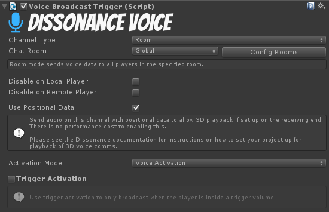

# Quick Start: Dissonance with Steamworks.NET P2P

> This Quick Start guide is for those of you integrating Dissonance into a game with the **Steamworks.NET P2P API**

This tutorial will guide you through the steps required to get a basic Dissonance setup working in your project. By the end of this tutorial, you will having working voice comms with all users talking in a global chat room.

Before beginning this tutorial, please refer to the [installation guide](Getting-Started.md) to learn how to install Dissonance into your project.

A demo scene for this tutorial can be found in the `Dissonance/Integrations/SteamworksP2P/Demo` folder.

## Step 1: Dissonance Comms Object

> Dissonance runs mostly from a single game object, which should be placed somewhere near the root of your scene. This object contains the main "Dissonance Comms" behavior, together with the Steamworks P2P networking script.

To place the default Dissonance object into your scene, drag and drop the `DissonanceSetup` prefab from the `Dissonance/Integrations/SteamworksP2P` folder into your scene.

Once you have instantiated the `DissonanceSetup` prefab, you should have an object with two scripts attached: "Dissonance Comms" and `SteamworksP2PCommsNetwork`.

### Step 1a: Setup Network Session

Dissonance does not manage your steamworks session, instead it uses whatever session you have already setup. This gives you maximum control over how you want the network session to be configured. Refer to the [Steamworks Networking Documentation](https://partner.steamgames.com/doc/features/multiplayer/networking) for details on how to setup a session. You can see example code in the `SteamworksDemoUi` component in the `Assets/Dissonance/Integrations/SteamworksP2P/Demo` folder.

Once you have a Steamworks session running you need to inform Dissonance about the state of the session when it changes. When you have a session running you need to start Dissonance, call one of `InitializeAsDedicatedServer`, `InitializeAsServer` or `InitializeAsClient` on the `SteamworksP2PCommsNetwork` component. The server is the central control point of the session, if it leaves the game you must stop Dissonance and pick a new server. When a player joins the session you must call the `PeerConnected` method. When a player leaves the session you must call the `PeerDisconnected` method.

## Step 2: Add a Broadcast Trigger

You now have a functional Dissonance comms system, but you are not yet transmitting anything.

Before you can speak to anyone, you need to add a "Voice Broadcast Trigger" script to our scene. This script can be placed anywhere, but for this tutorial, you should simply add it to the DissonanceSetup game object you created in step 1.

The "Voice Broadcast Trigger" controls when the user's microphone is being transmitted to other players, and to whom the user is talking. There are many configuration options on this script to provide more advanced control of under what sitations we should be transmitting and who to, but for this tutorial simply leave the settings at default.

The default broadcast trigger configuration includes two settings of note:
1. Transmit on *Voice Activation*. This means Dissonance will transmit whenever it detects that the user is speaking.
2. Transmit to the 'Global' chat room.

## Step 3: Add a Receipt Trigger

Now you are talking into the 'Global' room automatically whenever you speak. However, you still can't hear anyone speaking. This is because you are not listening to the 'Global' room and so you are not receiving any of these transmissions.

To listen to the 'Global' room, add a "Voice Receipt Trigger" to the scene. Like the "Voice Broadcast Trigger", this script can be placed anywhere, but for this tutorial you should simply add it to the DissonanceSetup game object.

Again, leave this on the default configuration, which should have trigger activation disabled and be listening to the 'Global' chat room.

## You're Done!

Congratulations, you have now added voice comms to your game! What to do next?

* [Transmit on key press with Push-to-Talk](../Tutorials/Push-to-Talk.md)
* [Set up per-team chat channels](../Tutorials/Team-Chat-Rooms.md)
* [Direct message another player](../Tutorials/Direct-Player-Transmit.md)
* [Send text chat messages](../Tutorials/Text-Chat.md)
* [3D Positional Audio](../Tutorials/Position-Tracking.md)
* [3D Area Chat Rooms](../Tutorials/Collider-Chat-Room.md)
* [Proximity Chat: Talk to players near each other](../Tutorials/Proximity-Chat.md)