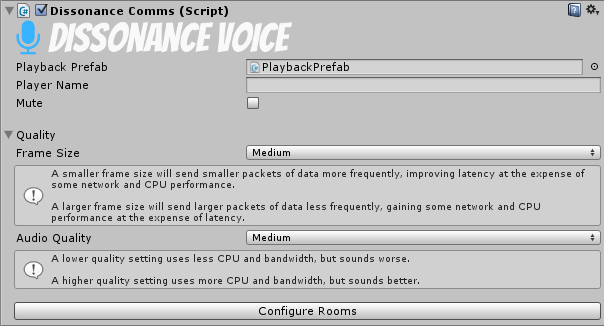

# Dissonance Comms

The Dissonance Comms component is the central place to configure Dissonance. There must be an active one within the scene for Dissonance to work.

## Playback Prefab

This is a prefab for the audio playback system. For every remote player who is in the voice session Dissonance will instantiate this prefab, and use it to play the voice from that player. If left blank the default playback prefab included with Dissonance will be used. Read more about the playback prefab and how you can customise it [here](../../Tutorials/Playback-Prefab.md).
 
## Mute

This will prevent the local player from sending any voice.

## Access Tokens

This is the set of [access tokens](../../Tutorials/Access-Control-Tokens.md) which the local player has.

## Voice Settings

Clicking this button opens an inspector where audio settings relating to voice may be changed.

## Configure Rooms

Clicking this button opens an inspector where rooms can be created or deleted.

## Diagnostic Settings

Clicking this button opens an inspector where Dissonance diagnostic settings may be changed (e.g. log levels).

# Scripting

Dissonance Comms is also the central place to access Dissonance from scripts.

## Readonly Properties

### IsNetworkInitialised : bool

Indicates if the Dissonance network has been successfully initialised yet.

### Rooms : Rooms

An object which exposes various properties and methods to do with rooms the local player is listening to. See further documentation [here](../Other/Rooms.md).

### PlayerChannels : PlayerChannels

An object which exposes various properties and method to do with players the local player is speaking to. See further documentation [here](../Other/PlayerChannels.md).

### RoomChannels : RoomChannels

An object which exposes various properties and methods to do with room the local player is speaking to. See further documentation [here](../Other/RoomChannels.md).

### Text : TextChat

An object which exposes various properties and methods to do with text chat. See further documentation [here](../Other/TextChat.md).

### Players : ReadOnlyCollection&lt;VoicePlayerState&gt;

A list of `VoicePlayerState` objects, one for each remote player currently in the session. See further documentation on `VoicePlayerState` [here](../Other/VoicePlayerState.md).

### TopPrioritySpeaker : ChannelPriority

The highest [priority](../../Tutorials/Channel-Priority.md) of all remote players currently speaking in the session.

### Tokens : IEnumerable&lt;string&gt;

The set of [tokens](../../Tutorials/Access-Control-Tokens.md) which the local player possesses.

### MicrophoneCapture : IMicrophoneCapture

The microphone capture object which Dissonance is currently using. This may be null if Dissonance has not initialised yet or if the local instance is a dedicated server.

---
## Properties

### LocalPlayerName : String

The name of the local player, this will be initialised to a unique ID per player when Dissonance starts. This may not be changed once Dissonance has started.

### PlayerPriority : ChannelPriority

The [priority](../../Tutorials/Channel-Priority.md) of the local player, if a channel is opened with no priority set this priority will be used as a default.

### MicrophoneName : string

Get or set the name of the microphone to use to capture voice. This may be changed at any time, if the microphone has already begun recording with a different name it will be reset to use the new name.

### PlaybackPrefab : VoicePlayback

Get or set the playback prefab which Dissonance will use to play back remote voices. This may not be changed once Dissonance has started.

### IsMuted : bool

Get or set if the local player is muted (i.e. prevented from sending any voice transmissions).

### IsDeafened : bool

Get or set if the local player is deafened (i.e. prevented from hearing any remote voice transmissions).

---
## Events

### OnPlayerJoinedSession : event Action&lt;VoicePlayerState&gt;

This event runs whenever a new player joins the Dissonance voice chat session. It is passed the object which represents the new player.

### OnPlayerLeftSession : event Action&lt;VoicePlayerState&gt;

This event runs whenever a player leaves the Dissonance voice chat session. It is passed the object which represents the player. The object will never be touched by Dissonance again - if the player rejoins a new object will be created for them.

### OnPlayerStartedSpeaking : event Action&lt;VoicePlayerState&gt;

This event runs whenever a remote player begins speaking in a channel which the local player can hear.

### OnPlayerStoppedSpeaking : event Action&lt;VoicePlayerState&gt;

This event runs whenever a remote player stops speaking in all channels which the local player can hear. 

This may not indicate that the remote player has actually stopped talking completely, it is possible that the local player simply stopped listening. For example if you are listening to _Room A_ and they are talking to _Room A_ and _Room B_, then when you stop listening to _Room A_ you will receive this event (even though they are still talking to _Room B_) because they have stopped speaking _from your point of view_.

### OnPlayerEnteredRoom : event Action&lt;VoicePlayerState, string&gt;

This event runs whenever a remote player begins listening to a new room. It is passed the object which represents the player and the name of the room.

### OnPlayerExitedRoom : event Action&lt;VoicePlayerState, string&gt;

This event runs whenever a remote player stops listening to a room. It is passed the object which represents the player and the name of the room.

### LocalPlayerNameChanged : event Action&lt;string&gt;

This event runs whenever the local player name is changed. Local player name may only be changed before the DissonanceComms component has been started.

### TokenAdded : event Action&lt;string&gt;

An event which runs whenever a token is added to the local player.

### TokenRemoved : event Action&lt;string&gt;

An event which runs whenever a token is removed from the local player.

---
## Methods

### FindPlayer(string name) : VoicePlayerState

Attempt to find the player with the given Dissonance ID. Will return null if no such player can be found.

### SubscribeToVoiceActivation(IVoiceActivationListener)

<a href="#subcribetovoiceactivationivoiceactivationlistener" style="visibility: hidden">Invisible anchor link for old misspelt version of this method</a>

Subscribes the given listener object to the voice activation detector (VAD) for the local player. When VAD detects speech the `VoiceActivationStart` method will be called. When the VAD stops detecting speech the `VoiceActivationStop` method will be called.

### UnsubscribeFromVoiceActivation(IVoiceActivationListener)

Unsubscribes a previously subscribed listener object from the VAD.

### SubscribeToRecordedAudio(IMicrophoneSubscriber)

<a href="#subcribetorecordedaudioimicrophonesubscriber" style="visibility: hidden">Invisible anchor link for old misspelt version of this method</a>

Subscribes the given listener object to the microphone recorded audio _after_ it has been preprocessed. This will receive all audio recorded by the mic whether or not it is being sent over the network. Use `DissonanceComms.RoomChannels.Count` and `DissonanceComms.PlayerChannels.Count` to determine if the audio is being sent anywhere.

### UnsubscribeFromRecordedAudio(IMicrophoneSubscriber)

Unsubscribes a previously subscribed listener object from the microphone audio stream.

### TrackPlayerPosition(IDissonancePlayer)

Begins [position tracking](../../Tutorials/Position-Tracking.md) for the player represented by the given object.

### StopTracking(IDissonancePlayer)

Stops [position tracking](../../Tutorials/Position-Tracking.md) for the player represented by the given object.

### AddToken(string)

Adds a [token](../../Tutorials/Access-Control-Tokens.md) to the local player.

### RemoveToken(string) : bool

Removes a [token](../../Tutorials/Access-Control-Tokens.md) from the local player and returns a bool indicating if that token was removed. This will return false if the player never had the token in the first place.

### ContainsToken(string) : bool

Returns a boolean value indicating if the local player has the [token](../../Tutorials/Access-Control-Tokens.md) with the given name.

### HasAnyToken(TokenSet) : bool

Returns a boolean value indicating if the local player has *any* of the [tokens](../../Tutorials/Access-Control-Tokens.md) in the given TokenSet.

### ResetMicrophoneCapture

Forces a complete restart of the audio capture pipeline.

### GetMicrophoneDevices(List<string> output)

Get a list of available microphones. Microphone names will be added to the `output` list.