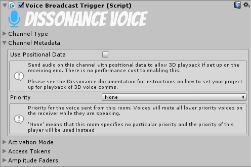

# Voice Broadcast Trigger

The Voice Broadcast Trigger controls when and where the local voice data is sent to.

## Channel Type

This section controls which channel voice data will be sent to with this trigger. There are three channel type options, which one you choose will change the rest of the channel type UI to match. Channel type can be set from scripts by modifying the `ChannelType` property.

#### Channel Type : Room

When using the "Room" channel type broadcaster sends voice to the specified room (a single room may have multiple speakers and multiple listeners). Available rooms are listed in a dropdown box and new rooms may be added by clicking the "Config Rooms" button. The target room name can be set from scripts by modifying the `RoomName` property.

#### Channel Type : Player

When set to "Player" the broadcaster sends voice directly to the specified player. The inspector will show a text box to enter the name of the player to send to. The target player name can be configured from a script by modifying the `PlayerId` field.

To get the names of other players inspect the Dissonance Comms component at runtime - when in a session it will show a list of all players in the session. To get the name of players by script enumerate the `DissonanceComms:Players` property.

#### Channel Type : Self

If you have set up [Position Tracking](../../Tutorials/Position-Tracking.md) then your player object will have an `IDissonancePlayer` component which identifies it to Dissonance. You can take advantage of this to send directly to players without having to know their name. When set to "Self" the broadcast component will look for an `IDissonancePlayer` component in this gameobject or any ancestor and will send directly to that player.

## Channel Metadata

This section controls which metadata is sent along with the channel.

#### Use Positional Data

This determines whether the playback of the data sent through this broadcaster should use 3D audio playback (i.e. voice will sound as if it is coming from a certain position in space). Positional audio requires some additional setup (but does not use *any* additional CPU or network bandwidth at all when enabled). See the [Position Tracking](../../Tutorials/Position-Tracking.md) tutorial for information about how to set up your project for position tracking of player objects. This option can be set from a script by modifying the `BroadcastPosition` field.

#### Priority

This determines the priority which this voice has for playback. Everyone who receives audio will compare the priority of all the audio streams they are receiving and will only play out the streams with the highest priority.

"None" is a special value which indicates that this broadcast trigger is setting no particular priority - the default priority for this player will be used instead. The default priority is set on the DissonanceComms component with the `PlayerPriority` property (if you do not set it it will have the priority `Default`). The priority values have this order:

 1. Low
 2. Default
 3. Medium
 4. High

## IsMuted : bool

When set to `true` this trigger will never activate.

This can be used to create a UI push-to-talk activated broadcast trigger - set the `Activation Mode` to `Voice Activation` and toggle the `IsMuted` property with a button. When muted by the UI no voice will be sent, when unmuted the trigger will automatically transmit when speech is detected.

## Activation Mode

This section controls how the broadcast trigger decides when to send voice. There are three activation options, which one you choose will change the rest of the activation mode UI to match. Activation mode can be set from scripts by modifying the `Mode` property.

#### Activation Mode : None

When set to "None" the broadcaster will never broadcast any voice.

#### ActivationMode : Voice Activation

When set to "Voice Activation" the broadcaster will automatically transmit when voice is detected in the microphone signal.

#### ActivationMode : Push To Talk

When set to "Push To Talk" the broadcaster will transmit when a given input axis is chosen. You must set the name of a Unity input axis and then configure it in the Unity input manager.

#### Collider Volume Activation

Using collider volume activation requires [Position Tracking](../../Tutorials/Position-Tracking.md) to be set up. When active the broadcast trigger will find a sibling physics trigger volume and will only send voice if the local player (as defined by the `IDissonancePlayer` component) is inside the volume.

## Access Tokens

This section controls which [Access Tokens](../../Tutorials/Access-Control-Tokens.md) are required to send with this broadcaster.

The DissonanceComms component keeps a set of tokens which the local player has. The broadcast trigger will only send voice if the player has one or more of the necessary tokens.

## Amplitude Faders

This section controls the amplitude and soft fading of voice sent with this trigger.

"PushToTalk Fade" (precise name depends upon which activation mode you have chosen) applies a soft fade in and out _every time_ speech is started or stopped (e.g. every time the push to talk key is pressed or released). This setting should be used with care; applying any fade in is inadvisable as it will cut off the start of what is being said. This fader can be configured from scripts by accessing the `ActivationFader` property.

"Volume Trigger Fade" (only available when volume trigger is in use) applies a soft fade every time the player enters or exits the volume. This fader can be configured from scripts by accessing the `ColliderTriggerFader` property.

Since there are two faders this means the trigger will have two different volumes to use, they will be multiplied together and the result is used as the actual volume value.

#### Channel Volume

This controls the maximum volume of the fader. This should be used with care; raising the amplification above one will cause clipping, which severely reduces audio quality.

#### Fade In Time

This controls how long it takes this fader to increase volume from 0 to the `Channel Volume` slider level.

#### Fade Out Time

This controls how long it takes this fader to decrease volume from `Channel Volume` slider level to 0. Note that this means voice will continue to be transmitted for this long even after the user has stopped pressing the push to talk key.

