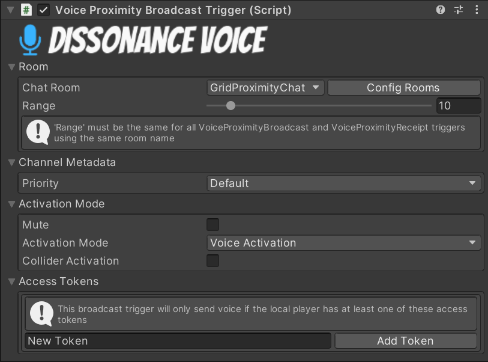

# Voice Proximity Broadcast Trigger

The Voice Proximity Broadcast Trigger sends voice to an infinite grid of "virtual rooms", creating a proximity chat system by placing nearby players into the same rooms.

## Room

This section controls which room the trigger sends to.

#### Chat Room

It is possible to have several proximity broadcast systems running simultaneously (e.g. one per team), the room name uniquely identifies this room.

#### Range

Set the distance to transmit voice, players within this distance will be considered "near" and will be placed into the same room.

!!! hint
    The range must be exactly the same for the broadcast trigger and the receipt trigger!

## Channel Metadata

#### Priority

This determines the priority which this voice has for playback. Everyone who receives audio will compare the priority of all the audio streams they are receiving and will only play out the streams with the highest priority.

"None" is a special value which indicates that this broadcast trigger is setting no particular priority - the default priority for this player will be used instead. The default priority is set on the DissonanceComms component with the `PlayerPriority` property (if you do not set it it will have the priority `Default`). The priority values have this order:

 1. Low
 2. Default
 3. Medium
 4. High

## Activation Mode

#### Mute

When set to `true` this trigger will never activate.

!!! hint
    This can be used to create a UI push-to-talk activated broadcast trigger - set the `Activation Mode` to `Voice Activation` and toggle the `IsMuted` property with a button. When muted by the UI no voice will be sent, when unmuted the trigger will automatically transmit when speech is detected.

#### Activation Mode

This controls how the broadcast trigger decides when to send voice. Activation mode can be set from scripts by modifying the `Mode` property.

 - `None`: Never broadcast any voice.
 - `Voice Activation`: Automatically broadcast when voice is detected.
 - `Push To Talk`: Broadcast when a given input axis is pressed. You must set the name of a Unity input axis and then configure it in the Unity input manager.
 - `Open`: Constantly broadcast unless muted.

#### Collider Activation

Only broadcast when the local player is inside a sibling collider volume.

## Access Tokens

Add [Access Tokens](../../Tutorials/Access-Control-Tokens.md) which are required for this broadcaster to broadcast voice. This trigger will only broadcast if the DissonanceComms component has one or more of the necessary tokens.