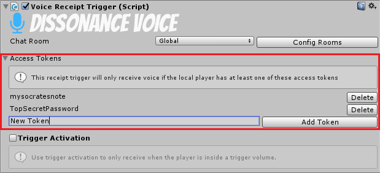

# Access Control Tokens

Also see [this video](https://youtu.be/HXMYDbuLwVI?t=250) about access tokens.

Access control tokens can be added to both [Broadcast Triggers](../Reference/Components/Voice-Broadcast-Trigger.md) and [Receipt Triggers](../Reference/Components/Voice-Receipt-Trigger.md). The trigger will not function unless the local player has *one of* the required tokens.

## Defining Required Tokens

Tokens can be added and removed through the inspector:



Tokens can also be managed with scripts:

```csharp
var receiver = FindObjectOfType<VoiceReceiptTrigger>();

receiver.AddToken("correcthorsebatterystaple");             // Add
if (receiver.ContainsToken("correcthorsebatterystaple"))    // Query
    receiver.RemoveToken("correcthorsebatterystaple");      // Remove
```

## Defining Available Tokens

Once triggers have been configured to require tokens you will need to add some tokens to the local player. This can be done in the inspector in the same way as for triggers. Tokens added in the inspector will apply to *all* players so they can only be used as the default tokens everyone starts with.


You are more likely to want to manage tokens through scripts. When you create a player and do something which requires restricting their access to channels (e.g. joining a team) you should add the appropriate tokens to the local player:

```csharp
var local = FindObjectOfType<DissonanceComms>();

local.AddToken("Green Team");
```

Assuming you have transmitters and receivers set up for every team, each one with a different token, this gives you a simple way to ensure that the player is speaking and listening to the right team channels.
