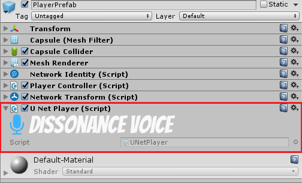

## Tutorial: Position Tracking

Also see [this video](https://youtu.be/HXMYDbuLwVI?t=1179) about position tracking.

This tutorial will explain how to configure your project to track the position of players. This is required for 3D positional audio playback of remote player voice chat and collider trigger support for `VoiceBroadcastTrigger` and `VoiceReceiptTrigger`.

## Setup Tracking

To setup position tracking you need to attach a single behaviour to all your player gameObjects. The behaviour can be found in the folder for the network integration you are using, for example for HLAPI it is located at `Assets/Dissonance/Integrations/UNet_HLAPI/HlapiPlayer.cs`. Ensure that this component is attached to *all* gameObjects in the scene which represent a player (the local player and all remote players). If you have a prefab which is used to construct your players you can simply attach the behaviour to this prefab.

Some network integrations do not include player tracking scripts. In this case you will need to implement it yourself. View the documentation for custom position tracking [here](Custom-Position-Tracking.md).
 

### What Does Position Tracking Cost?

Dissonance **does not send any extra data** across the network when position tracking is enabled - instead it relies on your game objects already being in the right place on every client and simply plays the audio from wherever they are in space. Enabling position tracking does not use any extra bandwidth.

## Using Position Tracking 

### Positional Audio

When positional audio is enabled the voice from remote players will sound like it is coming from the correct position. To enable this simply tick the "use positional data" checkbox on the voice broadcast trigger.

### Collider Chat Room

Voice broadcaster triggers and voice receipt triggers can be configured to only send/receive audio when the local player is inside a certain volume. See [this](Collider-Chat-Room.md) tutorial for how to achieve this.

### Direct Transmit To Player

When position tracking is enable transmitting to a specific player is simplified. If a `Voice Broadcast Trigger` is attached to a player entity it can be configured to transmit to the player represented by the game object. See [this](Direct-Player-Transmit.md) tutorial for details.

