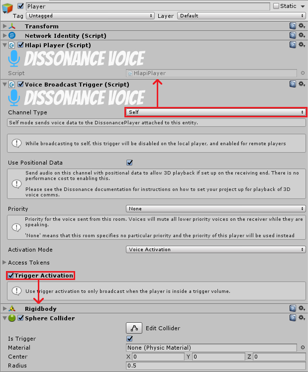

Dissonance includes two ways to set up proximity chat: `Grid Proximity` and `Collider Proximity`.

**Grid Proximity** uses spatial hashing to place nearby players all into the same room. This is simple to setup and scales very well even to a large number of players (no additional bandwidth is consumed no matter how many players are in proximity).

**Collider proximity** gives much more exact control over proximity - players are considered to be in proximity based on a Unity collider trigger which can be dynamically changed in shape and sizes by your scripts. Use this if you need very precise control of proximity chat.

## Grid Proximity

Before any kind of proximity chat can work you must set up [position tracking](Position-Tracking.md) to tell Dissonance where each player is. Each player in the scene should have a player tracker attached to them, the transform of this tracker is the position that Dissonance uses as the position of that player.

1. Add a `Voice Proximity Broadcast Trigger` to the scene. This controls when voice will be **sent**.
2. Choose a `Chat Room` for this trigger.
3. Choose a range, all other players within this distance will hear your voice.
4. Choose an `Activation Mode` which decides when voice should be transmitted.

1. Add a `Voice Proximity Receipt Trigger` to the scene. This controls when voice will be **received**.
2. Set the `Chat Room` to the same value as the broadcast trigger.
3. Set the range to **exactly the same value** as the broadcast trigger.

## Collider Proximity (Deprecated)

> is still supported, but should be considered **deprecated**. Prefer to use Grid Proximity where possible.

A more precise system of proximity chat can be set up by combining [direct player transmission](Direct-Player-Transmit.md) and [collider chat rooms](Collider-Chat-Room.md). Each player in your game should have a voice broadcast trigger attached to it (set to broadcast directly to that player) and configured as a collider chat room with a suitable collision volume (e.g. a large sphere). When two players stand close to one another they will enter each others transmission trigger volumes and begin talking to one another.

In this example channel type is set to "Self", this means the broadcast trigger searches for one of the Dissonance [position tracking](Position-Tracking.md) behaviours and transmits directly to the player which that represents.